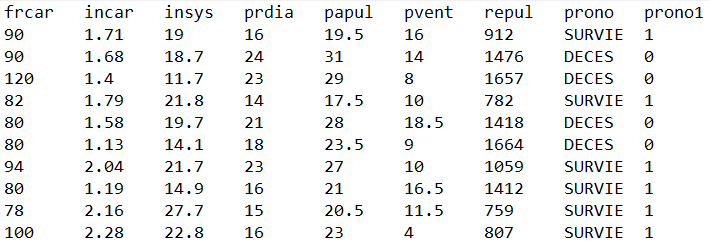
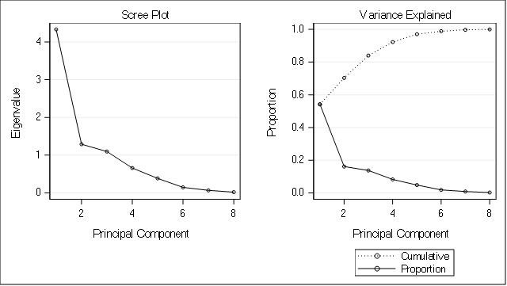
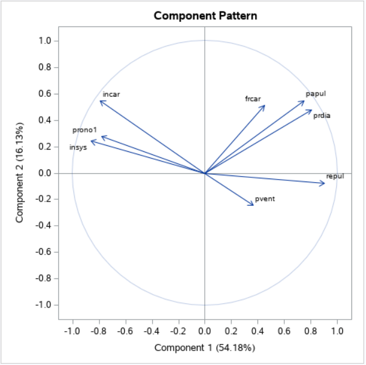
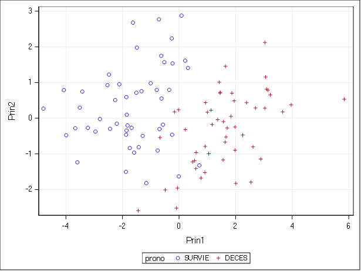

# Data analysis of the Myocardial Infarction :

## Intro :

The study involved 101 myocardial infarction victims (51 died, 50 survived) on whom the following seven variables were measured. Below is an extract of the data to be processed.

FRCAR : Cardiac frequency,
INCAR : Cardiac index,
INSYS : Systolic index,		
PRDIA : Diastolic pressure,
PAPUL : Pulmonary arterial pressure,
PVENT : Ventricular pressure,
REPUL : Lung resistance,

## Step 1 : univariate and two-dimensional descriptive analysis on the variables of the problem

It is noted that the higher the heart rate, diastolic pressure, pulmonary artery pressure and pulmonary resistance are in a victim the more likely he is to die. On the other hand, the higher the cardiac and systolic indexes, the more the victim concerned is likely to live.

Regarding the correlation we see that "the diastolic pressure" and "pulmonary arterial pressure" are very dependent on each other with a correlation = 0.93 ~ 1 (positively correlate), and we notice the same thing for the dependence (positively and negatively correlate) between “Pulmonary resistance” and most of the variables, which implies that these variables have an important influence on it, since it also has an influence on the other variables.

From the data extract we notice that the seven variables do not have the same unit / measure hence the need to work with the correlation matrix (reduced centered variables) instead of the variance-covariance matrix. In addition, one cannot represent the variables simultaneously in one and the same graph in the descriptive statistic univariate (resp. Bivariate). Consequently, it will be impossible to have similarities / dissimilarities between the profiles studied. It is impossible to create a p (> 3) dimensional cloud and if we choose to cross the variables two by two we make all of them unreadable and difficult to interpret.

Only the explanatory variables prono and prono1 are qualitative variables, the other variables are all quantitative variables. Hence the impertinence of using factor analysis to study the data.

## Step 2 : utilizing the principal component analysis method (PCA) for the reduction of dimensions

The objective of PCA is to return to a space of reduced dimensions (2 in most cases) while distorting reality as little as possible. It is therefore a question of obtaining the most relevant summary possible of the initial data. The PCA technique is used especially when the explanatory variables are quantitative, which is the case for our study.

The table below represents the proportion explained by the factors extracted :

We can be satisfied with working with only two axes since the cumulative proportion of the first two factors represents 70.31% of the information. Moreover, the graph of the eigenvalues versus the principal components (below) shows the same thing.

The coordinates of the variables are given by the table of eigenvectors below:

Correlation circle (Component pattern) can be visualised using the graph of variable :

The cloud of points can be visualised using the graph of individuals :

## Step 3 : summary of the analysis based on the results obtained

By observing the graph of individuals (above on the right), we notice that axis 1 differentiates between survival represented on the left of the graph by (o), and deaths represented on the right by (+). We can therefore interpret axis 1 as the axis of opposition between survival and death. The same can be concluded from the graph of variables. Since the initial variable prono1 (1 for survival, 0 for death) is negatively correlated with the first component. That is, individuals who have a weak coordinate on the first dimension survived, on the other hand, individuals who have a large coordinate on axis 1 died.

Unfortunately, the two charts of variables and individuals did not highlight an interpretation for the second dimension. In addition, all the variables studied seem to have a weak correlation with axis 2, which makes it difficult to interpret the latter.

From the correlation circle we see on the one hand that the variables REPUL, PRDIA and PAPUL are positively correlated with axis 1, especially the variable REPUL. Therefore, an increase in these variables may increase the chance of losing the affected victim. On the other hand, the INCAR and INSYS variables are remarkably negatively correlated with axis 1. This means that a decrease in one of these variables thus increases the risk of the victim dying.

For the variables FRCAR and PVENT, it is better not to consider them in the interpretation, because of their low quality of representation. In fact, these variables are less close to 1 or -1 compared to the first dimension than the other variables.

**In conclusion, we can say that the variable REPUL (Pulmonary resistance) can be considered as the best criterion for making a prognosis (SURVIVAL or DEATH) of a victim. Indeed, the doctors who are in charge of diagnosing the victim must be careful if the value of pulmonary resistance increases over time in order to take the appropriate actions.**

